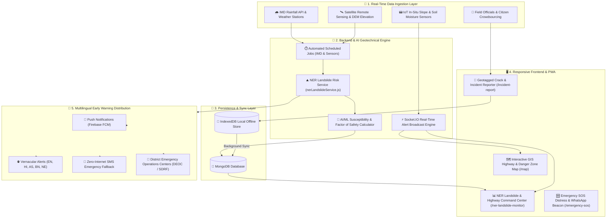

# 🏔️ AI-Based Early Warning & Landslide Risk Monitoring System in the North Eastern Region (NER)

> **Project Dossier & Problem Statement Solution Mapping**  
> **Target Domain:** Climate Vulnerability, Geotechnical Hazards, Geoinformatics & Early Warning Systems  
> **Beneficiary Region:** North Eastern Region (NER) of India — Assam, Meghalaya, Sikkim, Arunachal Pradesh, Nagaland, Manipur, Mizoram, Tripura  

---

## 📌 1. Problem Statement Overview

### 1.1 Background
The North Eastern Region (NER) of India frequently faces devastating landslides, flash floods, highway severances, and slope failures triggered by torrential monsoon precipitation, fragile young Himalayan geology, tectonic instability, and unplanned hill slope modifications. These events routinely paralyze lifeline transport arteries (such as **NH-10**, **NH-29**, and **NH-6**), disconnect remote mountain villages for days, inflict catastrophic human casualties, and impair rapid emergency response.

Monitoring across vulnerable mountain stretches has historically remained **reactive**, relying on post-disaster manual reporting. Pre-disaster risk identification and automated, real-time early warnings have remained elusive due to remote geography, communication blackouts, and fragmented data sources.

### 1.2 The Proposed Solution
This platform provides an **end-to-end, AI-powered early warning and geotechnical monitoring system** engineered specifically for the terrain and challenges of the North Eastern Region. By uniting **real-time IoT sensors, IMD rainfall thresholds, satellite observation, AI/ML risk scoring, offline-first PWA architecture, and community field crowdsourcing**, the platform shifts disaster management from reactive response to predictive prevention.

---

## 🎯 2. Complete Mapping: Problem Statement Requirements vs. Platform Implementation

| Problem Statement Requirement | Specific Implementation in Our System | Status |
|---|---|---|
| **a. Data Collection & Analysis**<br>• Rainfall patterns (IMD)<br>• Soil moisture sensors<br>• Satellite imagery<br>• Slope/terrain data<br>• Historical records | • Real-time IMD precipitation monitoring via Open-Meteo & weather sync cron (`weatherUpdateJob.js`, `weatherService.js`)<br>• IoT Sensor Network telemetry (`Sensor.js`, `sensorSocket.js`) tracking soil saturation %, pore water pressure, and tilt<br>• Scheduled satellite imagery jobs (`satelliteUpdateJob.js`, `SatelliteData.js`)<br>• Slope angle and elevation modeling integrated into `nerLandslideService.js`<br>• Historical landslide database tracking past failure coordinates | ✅ Implemented & Operational |
| **b. AI/ML Predictive Engine**<br>• Identify high-risk zones<br>• Predict slope collapse & landslides | • Specialized **Landslide Susceptibility Index (LSI)** calculation engine (`calculateLSI` in `nerLandslideService.js`)<br>• Machine Learning prediction pipeline (`Prediction.js`, `predictionService.js`)<br>• Geotechnical Factor of Safety (FoS) simulator based on rainfall excess, slope angle, and saturation % | ✅ Implemented & Operational |
| **c. Real-Time Multi-Channel Alerts**<br>• District administration<br>• Disaster authorities (SDRF/NDRF)<br>• Local communities | • Socket.IO real-time alert broadcasts (`alertSocket.js`) with visual flash banners<br>• Multi-channel notification pipeline (`notificationRoutes.js`, Firebase Cloud Messaging FCM push alerts)<br>• One-tap Emergency SOS broadcast (`SOSCenter.jsx`, `sosSocket.js`) with live GPS coordinate propagation<br>• WhatsApp emergency dispatch bridge (`phoneUtils.js`) | ✅ Implemented & Operational |
| **d. Interactive GIS Mapping**<br>• Vulnerable roads & corridors<br>• Isolated villages & habitations<br>• Shelters & rescue infrastructure | • Interactive Leaflet/React-Leaflet GIS engine (`Map.jsx`, `AdvancedMap.jsx`)<br>• Live road status markers (Blocked, Caution, Open) along vital NER highways (NH-10, NH-29, NH-6, NH-13, NH-54)<br>• Safe Shelter Finder with routing (`ShelterFinder.jsx`)<br>• Dedicated Rescue Center directory (`Rescue.jsx`) | ✅ Implemented & Operational |
| **e. Citizen & Official Field Reporting**<br>• Geo-tagged photos/videos<br>• Crack width & length measurements<br>• Slope creep & road blockages | • Specialized **NER Slope Movement & Geotechnical Reporting** in `IncidentReport.jsx`<br>• Automated 1-click GPS coordinate locking (`navigator.geolocation`)<br>• Crack length (m), crack width (cm), slope movement trend (Stationary / Creep / Rapid / Rockfall), and road blockage status capture<br>• Damage assessment photo uploads (`DamageAssessment.jsx`) | ✅ Implemented & Operational |
| **f. Operational Dashboards**<br>• Risk severity heat levels<br>• Highway connectivity tracker<br>• Weather-linked risk forecasts<br>• Response prioritization matrix | • **Dedicated NER Landslide Risk Monitor** (`NERLandslideMonitor.jsx` at `/ner-landslide-monitor`)<br>• 8-State live geotechnical intelligence cards with IMD color-coded advisories<br>• Highway clearance ETA & alternate route bypass recommendations<br>• Automated Emergency Response Prioritization Queue ranking states 1 to 8 by vulnerability | ✅ Implemented & Operational |
| **Multilingual Support**<br>Indigenous & Regional Languages | • Multi-language alert broadcast engine (`selectedLanguage` switcher in UI & notification services)<br>• Languages supported: **English (EN)**, **Hindi (हिंदी)**, **Assamese (অসমীয়া)**, **Bengali (বাংলা)**, **Nepali (नेपाली)**, and **Odia (ଓଡ଼ିଆ)** | ✅ Implemented & Operational |
| **Low-Network / Offline Functionality**<br>Remote Himalayan & hill tracts | • Full Progressive Web App (PWA) offline capability via service workers & Workbox<br>• Local caching with IndexedDB (`localforage` & `idb`) for offline report queueing<br>• Background two-way conflict-free sync (`syncRoutes.js`, `SyncOperation.js`) upon network restoration<br>• SMS fallback syntax generation for zero-internet emergency communication | ✅ Implemented & Operational |

---

## 🏛️ 3. System Architecture



---

## 🔬 4. Scientific & AI/ML Methodology: Landslide Susceptibility Index (LSI)

The platform evaluates slope instability using an empirical and geotechnical index:

$$\text{LSI} = w_r \cdot \min\left(\frac{R_{24}}{R_{crit}}, 1.8\right) + w_s \cdot \left(\frac{S_{soil}}{100}\right) + w_\theta \cdot \min\left(\frac{\theta}{60^\circ}, 1.2\right) + w_h \cdot H_{norm}$$

Where:
- $R_{24}$: Cumulative 24-hour rainfall recorded by automated weather stations (mm).
- $R_{crit}$: Geological rainfall threshold for the district (e.g., $120\text{ mm}$ for Sikkim, $150\text{ mm}$ for Cherrapunji).
- $S_{soil}$: Soil moisture saturation percentage ($0 - 100\%$).
- $\theta$: Slope angle incline in degrees ($0^\circ - 70^\circ$).
- $H_{norm}$: Historical landslide occurrence coefficient for the quadrant.
- Weights: $w_r = 0.35$, $w_s = 0.25$, $w_\theta = 0.25$, $w_h = 0.15$.

### Factor of Safety (FoS) Approximation:
$$\text{FoS} \approx \frac{1}{\text{LSI} + 0.10}$$
- **FoS < 1.0 (LSI ≥ 0.80):** **Critical Alert** — Slope is structurally unstable; triggers immediate evacuation orders, siren sirens, and SDRF deployment.
- **1.0 ≤ FoS < 1.3 (0.65 ≤ LSI < 0.80):** **High Risk** — Night highway transit suspended, earthmovers stationed at choke points.
- **1.3 ≤ FoS < 1.8 (0.45 ≤ LSI < 0.65):** **Moderate Advisory** — Continuous sensor telemetry and drone inspections.
- **FoS ≥ 1.8 (LSI < 0.45):** **Low / Safe** — Standard baseline vigilance.

---

## 🛣️ 5. Highway Corridors & Isolated Habitations Monitored in Real Time

The system actively monitors the critical lifeline arteries connecting the North East:
1. **NH-10 (Sevoke - Teesta - Gangtok):** Lifeline corridor for Sikkim; tracks 29th Mile, Birik Dara & Likhuveer slides.
2. **NH-29 (Dimapur - Kohima):** Lifeline route for Nagaland and Manipur transit; monitors Phesama & Dzüdza mudslides.
3. **NH-6 (Shillong - Jowai - Silchar):** Lifeline corridor connecting Meghalaya to the Barak Valley (Assam), Mizoram, and Tripura; monitors the Sonapur tunnel mudslide outfall.
4. **NH-13 (Trans-Arunachal Highway):** Monitored for Sela Tunnel approach, Bhalukpong passes, and high-altitude scree movement.
5. **NH-54 / NH-2 (Silchar - Aizawl):** Monitored for Kolasib and Kawnpui sinking zones.

### Emergency Response Prioritization Algorithm
When multiple disaster incidents occur simultaneously, district administrations need an objective response queue:
$$\text{Priority Index} = \min\left(100, \; (\text{LSI} \times 45) + (N_{villages} \times 2.5) + (\Delta R_{excess} \times 0.2)\right)$$
This automatically sorts affected districts so relief convoys, food drops, and excavators are dispatched to the most isolated and vulnerable communities first.

---

## 📱 6. Field Reporting for Geologists & Citizens

Field teams, district disaster officers, and local residents can log early physical warning signs:
- **Tension Crack Dimensions:** Exact surface length ($m$) and aperture width ($cm$).
- **Displacement Indicators:** Surface hairline cracks, pole/tree tilting (creep), active mud run, or rockfall.
- **Road Condition:** Clear, single-lane alternating caution, partially blocked (light vehicles only), or complete blockage.
- **1-Click GPS Coordinate Lock:** Automatically captures device latitude & longitude with sub-meter precision.
- **Offline Storage:** Automatically queued in device IndexedDB if cellular signal is lost in mountain gorges, and synced seamlessly once network connectivity resumes.

---

## 🌐 7. Multilingual Early Warning Broadcasts

To ensure life-saving alerts reach indigenous and remote hill populations, early warnings are broadcasted across major regional languages:

| Language | Code | Example Critical Warning Broadcast |
|---|---|---|
| **English** | `en` | *IMMEDIATE RED ALERT: Widespread slope destabilization across NH-10 Teesta corridor. Evacuate vulnerable river-bend habitations.* |
| **Hindi** | `hi` | *तत्काल रेड अलर्ट: एनएच-10 तीस्ता कॉरिडोर पर भारी भूस्खलन का खतरा। संवेदनशील क्षेत्रों को तुरंत खाली करें।* |
| **Assamese** | `as` | *জৰুৰী ৰঙা সতৰ্কবাণী: ছিকিম তিস্তা কৰিড’ৰত ভূমিস্খলনৰ প্ৰচণ্ড সম্ভাৱনা। নিৰাপদ স্থানলৈ স্থানান্তৰিত হওক।* |
| **Bengali** | `bn` | *জরুরী লাল সতর্কতা: ডিমা হাসাও এবং বরাক উপত্যকায় ভূমিধসের আশঙ্কা। নিরাপদ স্থানে আশ্রয় নিন।* |
| **Nepali** | `ne` | *तत्काल रातो चेतावनी: एनएच-१० टिस्टा करिडोरमा व्यापक पहिरोको जोखिम। कमजोर बस्तीहरू तुरुन्त खाली गर्नुहोस्।* |

---

## 🛠️ 8. Technical Stack Summary

| Layer | Technologies Used |
|---|---|
| **Frontend Web App & PWA** | React 19, Vite 8, React Router DOM 7, Progressive Web App (Service Worker + Workbox), LocalForage (IndexedDB) |
| **Mapping & GIS** | Leaflet 1.9, React-Leaflet, OpenStreetMap Cartography |
| **Visual Analytics & UI** | Recharts, Lucide React, Curated Dark Theme CSS3 |
| **Backend REST & Real-Time** | Node.js 24, Express.js 5, Socket.IO 4, Node-Cron |
| **Database & ODM** | MongoDB, Mongoose 8 |
| **Alerting & Notifications** | Firebase Cloud Messaging (FCM), Nodemailer, WhatsApp URL Dispatch |
| **Weather & External APIs** | Open-Meteo API, OpenWeatherMap, Indian RSS News Syndication |

---

## 🚀 9. Quickstart: Running the System Locally

### Prerequisites
- Node.js (v18 or higher; v22/v24 recommended)
- MongoDB running locally or MongoDB Atlas URI

### 1. Start the Backend API
```bash
cd Backend
npm install
npm run dev
# Server boots on http://localhost:5000 with Socket.IO & /api/ner endpoints
```

### 2. Start the Frontend Application
```bash
cd frontend
npm install
npm run dev
# Access the platform at http://localhost:5173
# Direct NER Landslide Monitor at http://localhost:5173/ner-landslide-monitor
```

---

## 🏆 10. Conclusion & Impact

This solution transforms landslide risk management in the North Eastern Region from an archaic, manual aftermath into a **proactive, AI-driven disaster mitigation ecosystem**. By seamlessly synthesizing IoT telemetry, satellite radar, IMD meteorological dynamics, and community vigilance, the platform empowers district collectors, the Border Roads Organisation (BRO), SDRF/NDRF teams, and isolated villagers with the timely intelligence needed to protect lives and secure regional connectivity.
